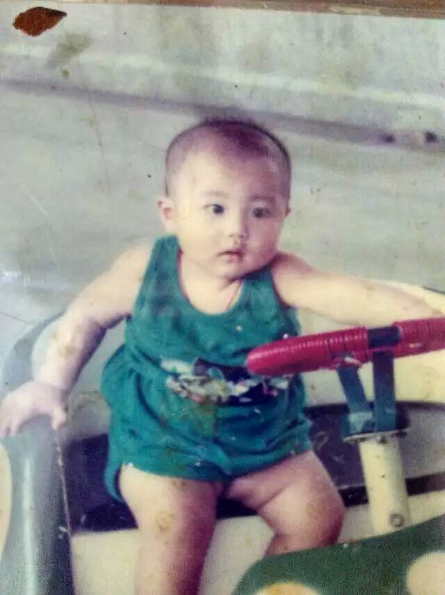
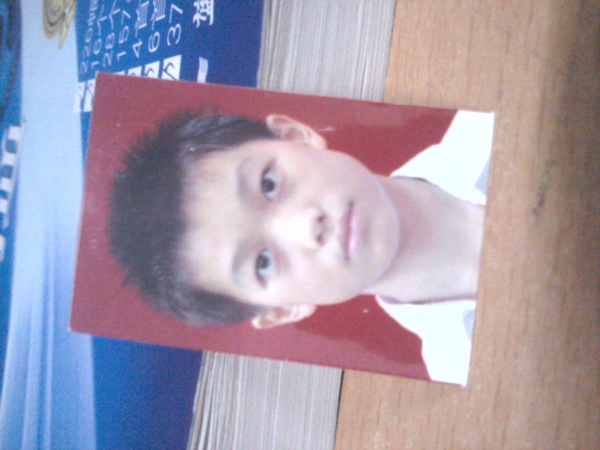

# 关于我

> &#x20;我的泰勒公式还在展开

## 宝宝

<div align="left">

<figure><figcaption><p>在公园里玩碰碰车</p></figcaption></figure>

</div>

宝宝还是个小胖子，但那个时候的记忆已经很模糊了，只有几个画面，住在我爸工作的地方，家外面有个凉茶铺，还有个麦当劳，我最喜欢了。

## 幼儿园

午休调皮被罚，不会从 1 数到 100，参加过跳舞表演，阿这。。。

## 小学

<div align="left">

<figure><figcaption><p>吉他自学3月通</p></figcaption></figure>

</div>

不知道是几年级，有了人生第一台 PC，联想电脑，最喜欢玩 《三维弹球》。后来接触到互联网，电话拨号，上网还不能打电话，一下就被老妈发现了。网游也是那个时候兴起的，《石器时代》、《仙境传说》、《梦幻西游》 都是神一般的游戏。

有了网游，木马病毒也就来了，每次电脑中毒都是把主机抬起来，坐上我爸的小摩托，送去联想的服务站重装系统。还记得杀毒软件吗，当时我觉得最厉害的是卡巴斯基，360 谁用谁知道。

学习方面，好像从 5 年级开始突然喜欢数学了，还参加了 24 点比赛，买了扑克牌在家里不停的练习，这是我人生第一次对胜利的渴望。比赛那天所有题目都是秒解，除了一道我差点没做出来，记得清清楚楚。

```
3, 3, 3, 3
```

最后还是顺利拿到一等奖，后面发现其实更难的题目是类似下面这种。

```
1, 5, 5, 5
1, 3, 4, 6
```

数学以前看不懂的题目，不知道是不是因为年龄的增长，突然都懂了，华罗庚的题目也觉得很有意思。数学成绩是上去了，但语文英语还是半桶水，所以初中还是没考上好的学校，哈哈。

## 初中

这个初中就不得了了，这段经历真的难忘。

因为学校离家很远，也很大，是有住宿的，所以周未才回家。每次上学我妈就给我搞一堆纯牛奶，那个时候喜欢打蓝球，吃的也多，晚上睡前喝牛奶，身体就长了，整个初中从 160 长到了 176。

学校的学习气氛是很一般的，有打架的、霸凌同学的、偎亵女生的、喝止咳药水的，这些都是我亲眼看到过的，发生在我身边的事情。有一次，高年级的学生在我们自习的时候，直接走过来，拿了个水瓶，直把我室友那的头爆了，瓶子碎了，还好我那室友头硬，只流了一点血。等我室友反应过来的时候，不知道从哪里找出一根铁棍，正要冲上去找他报仇，我的语文老师冲出来了，一把抱住我室友，动不了，这才告一段落。

我呢，胆小怕事，只爱学习，所以在班里成绩一直不错。最喜欢历史老师，地理老师，所以这两科成绩都很好，至于数学，我只能说，就没有我不会的题哈哈哈，我可是数学课代表。

中考来了，我考了全班第一，全年级排30左右吧，我不太记得了
