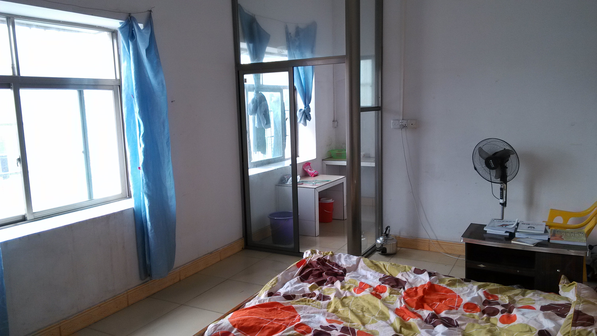

# 关于我

## 东小学

不知道是几年级，有了人生第一台 PC，联想电脑，最喜欢玩 《三维弹球》。后来接触到互联网，电话拨号，上网还不能打电话，一下就被老妈发现了。网游也是那个时候兴起的，《石器时代》、《仙境传说》、《梦幻西游》 都是神一般的游戏。

有了网游，木马病毒也就来了，每次电脑中毒都是把主机抬起来，坐上我爸的小摩托，送去联想的服务站重装系统。还记得杀毒软件吗，当时我觉得最厉害的是卡巴斯基，360 谁用谁知道。

学习方面，好像从 5 年级开始突然喜欢数学了，还参加了 24 点比赛，买了扑克牌在家里不停的练习，这是我人生第一次对胜利的渴望。比赛那天所有题目都是秒解，除了有一道我差点没做出来。

```
3, 3, 3, 3
```

最后还是顺利拿到一等奖，后面发现其实更难的题目是类似下面这种。

```
1, 5, 5, 5
1, 3, 4, 6
```

数学以前看不懂的题目，不知道是不是因为年龄的增长，突然都懂了，华罗庚的题目也觉得很有意思。数学成绩是上去了，但语文英语还是半桶水，所以初中还是没考上好的学校，哈哈。

## 初中

这个初中就不得了了，这段经历真的难忘。

因为学校离家很远，也很大，有住宿的，所以周未才回家。每次上学我妈就给我搞一堆纯牛奶，那个时候喜欢打蓝球，吃的也多，晚上睡前喝牛奶，身体就长了，整个初中从不到 160 长到了 176。

学校的学习气氛是很一般的，有打架的、霸凌同学的、偎亵女生的、喝止咳药水的，这些都是我亲眼看到过的，发生在我身边的事情。有一次，高年级的学生在我们自习的时候，直接走过来，拿了个水瓶，直把我室友那的头爆了，瓶子碎了，还好我那室友头硬，只流了一点血。等我室友反应过来的时候，不知道从哪里找出一根铁棍，正要冲上去找他报仇，我的语文老师冲出来了，一把抱住我室友，动不了，这才告一段落。

我呢，胆小怕事，只爱学习，所以在班里成绩一直不错。最喜欢历史和地理老师，所以这两科成绩都很好，至于数学，我只能说，就没有我不会的，我可是数学课代表哈哈哈。

中考全班第一，这是我人生第一次且最后一次的全班第一。我的分数离我想去高中，还差 30 分，但是因为当时有政策，全年级排名前 X 的，可以保送，整个年级有 1000 多人，我排 30 左右，幸运的去了一所好高中。这也是我第一次意识到，环境对人的影响是有多大，如果不是因为政策，我们学校估计也没几个能考上，后来这个政策自然也是取消了。

## 高中

这里的学霸可就多了，印象最深刻的是有些人英语好的离谱，口音都像收音机里面的外国人，后来大多数都出国读书了，人与人之间的起跑线真不一样。

虽然我的成绩刚进来的时候是倒数的，但是环境对人的影响很重要，知道家里没什么钱，没什么关系，自然我的心思也是在学习上。我最喜欢的数学，依然在班里数一数二，也交到一个好朋友，我数学上的竞争对手，我们都相信世界的真理都都能在数学里找到答案。

高考来了，改革第一年，文综理综很简单，但数学超级难，我总分 621，刚好压在一本线上。数学 132 分，和我的好朋友一样的分数，这一次我们没有分出胜负。

填报志愿的时候，我妈想让我读医，毕业再找点关系，但越是从这种环境长大的，就越不想求人，而且我没有兴趣，我只喜欢理工科。在学校的选择上，当时广工还是 2A，只有华农一直守在一本线上，所以第一志愿我填了华农，第二才是广工。至于专业，第一填了通信工程，高中时期深深被以光速传播的电磁波所吸引，这种打破物理距离的通信方式实在太神奇了，麦克斯韦（Maxwell）也是我当时的偶像。第二填了软件工程，这是因为高中时期做视频剪辑接触了 PS 和 PR 这两个软件，Adobe 是我当时的偶像，我也想写出那些用于创作者的软件。

## 大学

华南农业大学，软件工程，就这样，我踏上了 4 年的大学时光。

最有印象的课程是密码学，那应该是我数学知识的顶峰了。证明费马小定理，用程序实现米勒-拉宾素性测试（Miller-Rabin Primality Test），AES 对称加密，RSA 非对称加密，真是太好玩了，不过都是玩具，不能用在生产上，毕竟 OpenSSL 都已经成为标准了。

中间考过一次研，失败了，其实在备考的时候已经知道结果，我并不是搞科研的材料，越学到后面，对自己的认识就越清楚。我高中的好朋友，大学读的应数专业，后面保研了，这一次我是输给他了，心服口服，哈哈。

4 年收获最大是我的室友，一起学习，一起弹琴，一起打排球，即使到现在我们还一直联系，我们都很喜欢 ONE PIECE，就这样，我们毕业了。

## 115 网盘

考研错过了校招，毕业后我就直接回家了。找工作的时候，面试都挂了，本想着再找不到的话，就回广州找了，没想到最后一家面试的公司通过了，没错，就是 115 网盘。至今我都还记得那个炎热的下午，做了一份 PHP 相关的笔试题，简单聊了一下，工资 3 千，准备入职，对我来说这是一个大公司，太开心了！

<figure><figcaption><p>真的很酷</p></figcaption></figure>

因为公司离家很远，我就在公司附近租了房子，一个月 45 百，刚开始没有窗，没有洗衣机，天冷就用煲热水洗澡，后来才好了一点，换到一个有窗的房间，现在回看还真有点感慨。

<figure><figcaption><p>看到 VIM 的书吗哈哈哈</p></figcaption></figure>

大佬和我说，我们开发不用 Windows，用 Linux，让我先安装 Ubuntu 系统，和配置 PHP 的各种环境，有问题就百度或 Google。这一搞就是好几天，各种报错，汗流浃背，不过最后调通的时候，那个极度的快感真是太爽了。

<figure><figcaption><p>I love Ubuntu</p></figcaption></figure>

看到图片里的时间，7:53 分我就在公司了，从出租房走路到公司只要 10-20 分钟，公司有空调，网络好，环境好，我都想 24 小时呆在公司。那个时候每天晚上都很晚走，我当时觉得我不是上班，不是下班，更不是加班，我是在做我喜欢的事情，每一秒我都很开心，真特么纯粹。

雨林木风，知道这个名字的人年龄应该也不小了吧，早期安装 Windows 系统的人一定有听过，这个名字其实是 115 网盘老板“赖霖枫”的拆字，挺有意思的。刚刚查了一下，原来总部已经不在东莞了，因为老板是梅州人，现在已经迁到梅州了。

115 网盘是 2009 年上线的，比百度网盘还要早，可能是最早分这块蛋糕的“人”了，所以用户量和数据量是很大的。当时的分表真的把我吓到了，文件快照分了 8096 张表，有些总表的数据量甚至达到 10 亿级别，DBA 和我说这表没法动了，只能查已有索引的数据，删也只能写脚本一点点删。没想到第一家公司的分表规模成为了我从业已来最大的一家，虽然看起来很不科学，但 10 年前似乎也没什么高大上的方法。

至于 PHP，现在已经很少人用了，被市场抛弃了，不可否认的是，在巅峰时期，它的开发效率和开源社区，都是前所未有的，对 Web 的发展也做出了巨大的贡献。

<figure><figcaption><p>部署代码</p></figcaption></figure>

当时我们就是用上面这台机子部署代码的，在 TortoiseGit 小乌龟上把 PHP 代码同步到线上，左边代码仓库，右边正式环境，点点小指头，rsync 就把代码同步到所有 Web 机器，真是又快又粗暴，这种古早画面现在再也不会出现了。

<figure><figcaption><p>大晚上换轮胎</p></figcaption></figure>

我很喜欢坐这哥们儿的车，他和我年纪差不多，和我一样，刚进公司，都是小白。我们都喜欢周杰伦，他的车后面装了音箱，听起歌来贼拉风，因为他家境很好，我们老大都调侃他说是来体验生活的。有一次他写了一个 BUG，不小心把根目录传到了 rm 指令的后面，代码一上线，立刻短信电话都来了，好几台服务器直接挂了，他也吓懵了，最后还哭了。不过事情不是很严重，老大安抚了一下，事情就过去了，那个时候，大家都很单纯，自己人。

再后来，我还是决定要去广州，所以我辞职了，但这一段经历真的毕生难忘。

## 广州租房

我和大学室友说，我要来广州了，我们一起合租吧，就这样，我们又聚到了一起。

<figure><figcaption><p>阳台=阳光=希望</p></figcaption></figure>

这是我们刚搬进来的时候，没有任何家具，椅子和冰箱都是刚买的，真是年轻。

<figure><figcaption><p>大学宿舍2.0</p></figcaption></figure>

这个房子，3个房间，我们一起睡一个房间，还有一个琴房，一个杂物房。

<figure><figcaption><p>中二吧</p></figcaption></figure>

这是我们的工作台，我们船长坐中间，上面还挂了我们的旗子，没事就一起吃肯得基看海贼王。我们他都喜欢装X，一起学 VIM，一起学五笔打字，我还送了他一个域名，luffy
